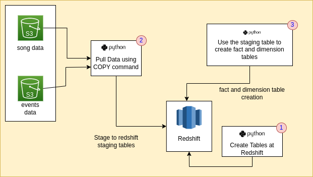

# Sparkify Data Ingestion using AWS.
## Introduction: As a Data Engineer coming into the analytics division of Sparkify, the task given is to ingest the raw data both songs data, event logs data stored in Amazon S3 into Redshift for data analysis, reporting and visualization.

## Design of the architecture:

## Steps for Setup:
1. Unzip the provided repository.
2. To ensure the setup is all in place, first create a python virtual environment using `python3 -m venv .venv`
3. Activate the venv using `source .venv/bin/activate`
4. Install the required packages using `pip install -r requirements.txt`
5. This should setup the project, let us move on to the ingestion part.
   
## Steps of Ingestion:
1. Using Infrastructure as Code, a command line utility is create which will create, delete, delete_role for the redshift cluster. To run it, using `python3 IaC.py`. A prompt is provide use `create`- To create the cluster based on dwh.cfg configurations, `delete`-Delete the cluster, `delete_role`-To delete existing roles. 
2. After the cluster is created based on the architecture, our first step is to create the required tables for which we will use the `create_tables.py` with the command `python3 create_tables.py`
3. After creating the tables, step 2 will be pulling the data from S3 bucket as per the provided paths in the dwh.cfg file for the song and log data and ingestion of the data into staging tables in Redshift in our case.
4. Using the staging tables, the fact and dimension tables are created. For both step2,step3 execute the `python3 etl.py` file.
5. Finally, to analyze queries an `python3 analyze_insertion.py`, test_sql.ipynb, test_aws.ipynb are utilized.
6. Once everything is completed do not forget to terminate your cluster using `python3 IaC.py` and using `delete` in the prompt.

## Tables Design:
1. The staging tables follow the same data types as person the json data obtained through using pandas reading the json and performing a data.info(). In the same fashion the data types for columns are created. The timestamp convertion from unix timestamp to a timestamp had to be checked for proper working condition. It was noted that using `timestamp 'epoch' + cast(ts AS bigint)/1000 * interval '1 second'` works the best and is performant.
2. Once, the staging tables are created, the sortkeys are assigned to timestamp column to the fact table (songplays) and the respective dimension table (time). In the similar fashion a distribution of the fact table by the timestamp is also done using distkey.
3. In the similar way, the artist_id is a foreign key to the songs dimension table, so in order to achieve optimization through partitioning distkey is used. 

## Analysis:  
Some of analysis performed were:
1. To know how many Mac and Windows users are using the sparkify app. It was noticed that the numbers for mac users are large.
2. A count of all fact and dimension tables are generally taken to test the insertion.
3. A query to get the songs for a given date is also tested.